# 📺 LOQO AI — News URL to Dynamic Broadcast Screenplay Generator

> A multi-agent AI pipeline powered by **LangGraph** that transforms any public news article URL into a **60–120 second professional TV news broadcast screenplay** — complete with timed anchor narration, segment-wise changing headlines, visual packaging, and AI-driven quality assurance with targeted retries.

---

## 📋 Table of Contents

1. [Problem Statement](#-problem-statement)
2. [Solution Overview](#-solution-overview)
3. [System Architecture](#-system-architecture)
4. [Agent Deep Dive](#-agent-deep-dive)
5. [LangGraph Workflow](#-langgraph-workflow)
6. [Conditional Edge Routing](#-conditional-edge-routing)
7. [Evaluation & Retry Mechanism](#-evaluation--retry-mechanism)
8. [State Schema](#-state-schema)
9. [Output Format](#-output-format)
10. [LangFuse Observability](#-langfuse-observability)
11. [Tech Stack](#-tech-stack)
12. [Project Structure](#-project-structure)
13. [Quick Start](#-quick-start)
14. [Streamlit Web UI](#-streamlit-web-ui)

---

## 🎯 Problem Statement

### The Challenge

Traditional news summarization tools produce **flat, static text summaries** that lack the dynamic structure needed for video broadcast. Real TV news segments are not just "summaries" — they are carefully crafted packages where:

- The **narration evolves** across timed segments (opening hook → details → impact → closing)
- **Headlines change** on-screen as the story progresses
- **Visuals switch** between anchor shots, source images, and AI-generated support graphics
- The **pacing and transitions** are carefully choreographed for viewer engagement

### What This Project Does

This system takes a **single news article URL** and produces a **broadcast-ready screenplay** — not a summary, but a **structured, timed, multi-layered production script** that an AI avatar video system could directly consume.

```
┌─────────────────────────┐          ┌────────────────────────────────────────────┐
│                         │          │          BROADCAST SCREENPLAY              │
│   News Article URL      │          │                                            │
│                         │  ─────►  │  ✅ Timed narration segments (60-120 sec)  │
│   (single public URL)   │          │  ✅ Per-segment changing headlines          │
│                         │          │  ✅ Visual plans (source + AI images)       │
│                         │          │  ✅ Transitions & layout instructions       │
│                         │          │  ✅ QA-scored & quality-verified            │
└─────────────────────────┘          └────────────────────────────────────────────┘
```

### Scope

| ✅ Must Build (In Scope) | ❌ Not Required (Out of Scope) |
|---|---|
| Article text + image extraction | Actual video generation |
| 60–120 sec anchor narration | AI image generation |
| Time-based segment breakdown | TTS / avatar rendering |
| Segment-wise headlines + subheadlines | Video editing or export |
| Visual placement planning | Audio/music |
| AI support visual prompts | |
| Structured JSON + human-readable output | |
| QA scoring + conditional retries | |
| LangFuse observability | |
| Streamlit web interface | |

---

## 💡 Solution Overview

We solve this with a **4-agent orchestration pipeline** built on **LangGraph**, where each agent handles a specific aspect of broadcast production:

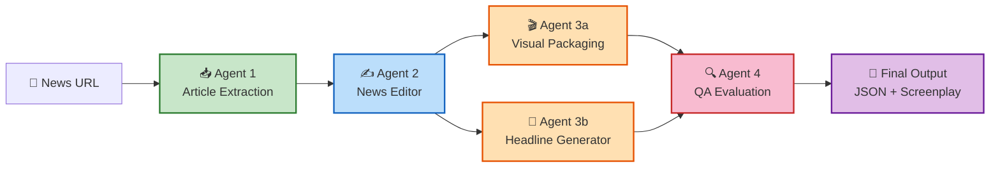

**Key Design Decisions:**
- **Agent 1** uses pure tooling (no LLM) — deterministic extraction avoids hallucination at the data layer
- **Agents 3a & 3b** run in **parallel** — headlines don't depend on visual decisions, saving time
- **Agent 4** triggers **targeted retries** — only the failing agent re-runs, not the whole pipeline
- **Gemini 2.0 Flash** with `with_structured_output()` ensures type-safe, validated LLM responses

---

## 🏗 System Architecture

### High-Level Architecture Diagram

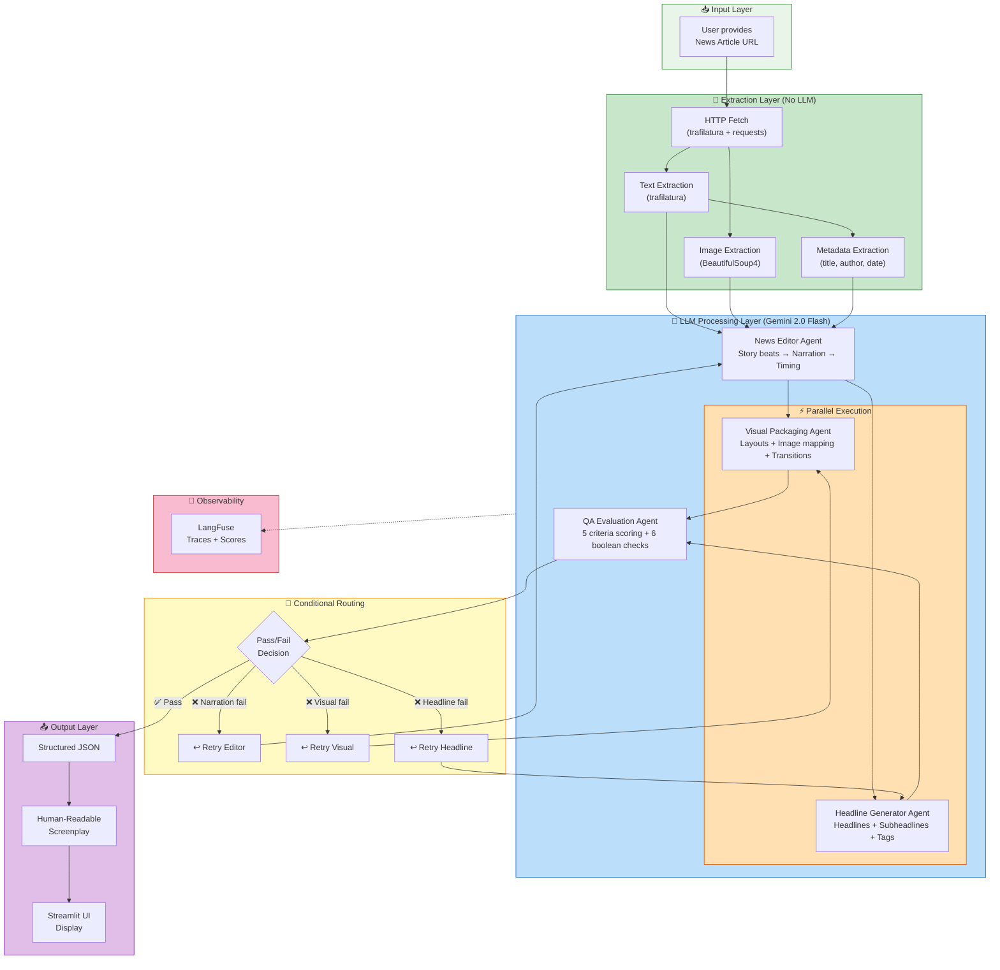

### Data Flow Summary

```
URL → [raw HTML] → [clean text + images + metadata]
    → [story beats + timed narration segments]
    → [visual plan per segment] + [headline plan per segment]  (parallel)
    → [QA scores + pass/fail decision]
    → [conditional: finalize or retry specific agent]
    → [merged JSON + formatted screenplay]
```

---

## 🤖 Agent Deep Dive

### Agent 1: Article Extraction Agent

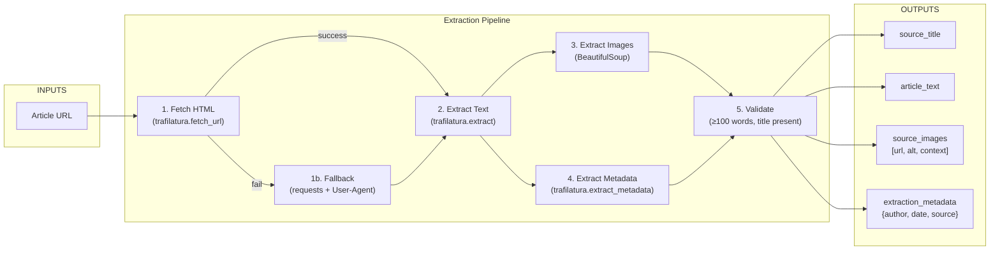

**Why no LLM?** Article extraction is a deterministic task. Using an LLM here would risk:
- Hallucinating content not in the original article
- Inconsistent extraction across runs
- Unnecessary API costs and latency

**Image Filtering Logic:**
```
For each  tag found:
├── Skip if URL contains: logo, icon, avatar, ad, pixel, tracking
├── Skip if dimensions < 200×150 pixels
├── Skip if data: URI or .svg format
├── Resolve relative URLs → absolute
├── Extract surrounding <figcaption> or <p> as context
└── Keep as {url, alt_text, context}
```

---

### Agent 2: News Editor Agent

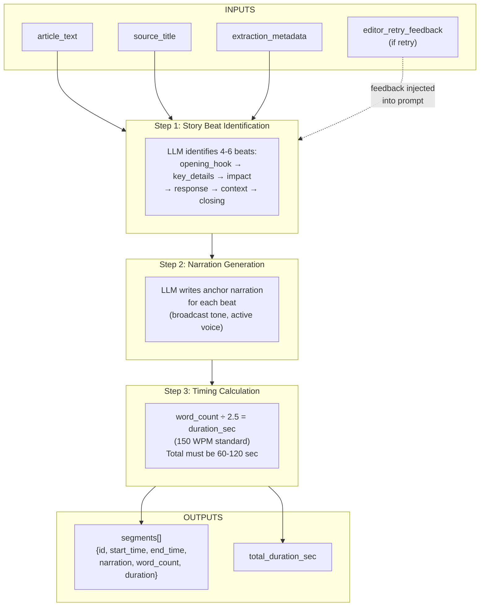

**Narration Writing Rules (enforced via system prompt):**

| Rule | Good Example ✅ | Bad Example ❌ |
|---|---|---|
| Strong opening hook | *"Breaking tonight, panic spread across the market after a major fire..."* | *"This article is about a fire incident that happened..."* |
| Active voice | *"Officials say emergency teams reached within minutes."* | *"It has been stated that according to officials..."* |
| Short sentences (≤20 words) | *"Police diverted traffic. Local residents were told to stay back."* | *"Police have also taken steps to divert the traffic around the affected area while simultaneously asking residents to maintain safe distance."* |
| No invented facts | Only info from source article | Adding details not in the article |
| Clear closing | *"We will continue to monitor. Stay tuned for updates."* | Story just stops mid-fact |
| Teleprompter-ready | Written to be spoken aloud | Written like a newspaper article |

**Timing Calculation:**
```
Reading speed: 150 words per minute = 2.5 words per second

Example:
  Segment 1: 30 words → 30 ÷ 2.5 = 12 seconds → [00:00 – 00:12]
  Segment 2: 28 words → 28 ÷ 2.5 = 11 seconds → [00:12 – 00:23]
  Segment 3: 35 words → 35 ÷ 2.5 = 14 seconds → [00:23 – 00:37]
  ...
  Total: must fall in [60, 120] seconds
```

---

### Agent 3a: Visual Packaging Agent

> ⚡ **Runs in PARALLEL with Agent 3b (Headline Generator)**

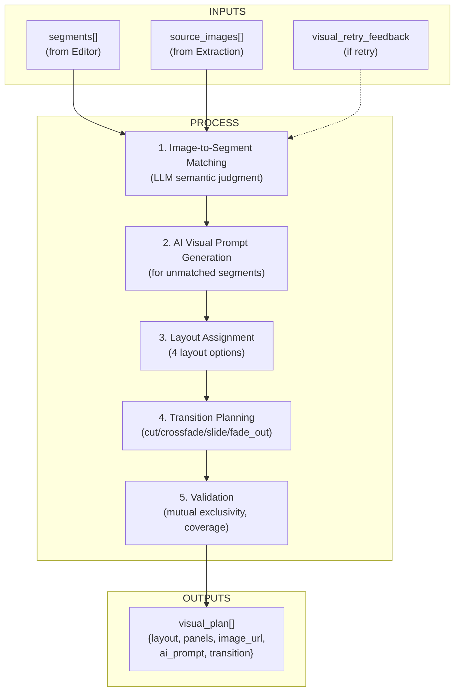

**Layout Options:**

| Layout | When to Use | Screen Arrangement |
|---|---|---|
| `anchor_left + source_visual_right` | Source image available and relevant | 👤 Anchor \| 🖼️ Source image |
| `anchor_left + ai_support_visual_right` | No source image; AI generates visual | 👤 Anchor \| 🎨 AI visual |
| `fullscreen_visual` | High-impact moments (rare) | 🖼️ Full-screen with VO |
| `anchor_only` | Opening/closing with no visual needed | 👤 Anchor only |

**Transition Types:**

| Transition | Effect | Default Usage |
|---|---|---|
| `cut` | Hard cut | Fast-paced segments |
| `crossfade` | Smooth blend | Topic shifts |
| `slide` | Lateral slide | Same topic, new visual |
| `fade_out` | Fade to black | **Final segment only** |

**Validation Rules:**
- Every segment must have exactly one visual assignment
- `source_image_url` and `ai_support_visual_prompt` are mutually exclusive (never both set)
- A single source image used for max 2 segments
- No same layout for >2 consecutive segments
- Last segment MUST use `fade_out`

---

### Agent 3b: Headline Generator Agent

> ⚡ **Runs in PARALLEL with Agent 3a (Visual Packaging)**

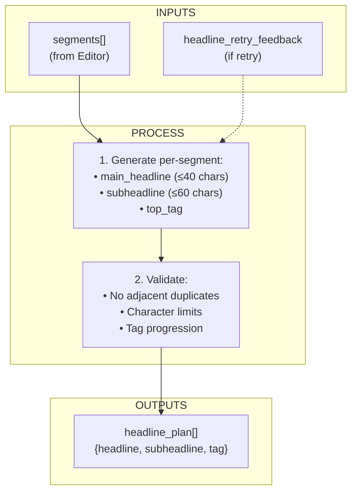

**Top Tag Progression (natural flow across segments):**

```
Segment 1: BREAKING    — "Something just happened"
Segment 2: LIVE        — "We're covering it now"
Segment 3: DEVELOPING  — "The situation is evolving"
Segment 4: UPDATE      — "New information coming in"
Segment 5: LATEST      — "Here's where things stand"
```

**Headline Quality Examples:**

| Criterion | Good ✅ | Bad ❌ |
|---|---|---|
| Length | `Major Fire Hits Delhi Market` (28 chars) | `Authorities And Emergency Response Teams Continue To Manage The Fire` (70 chars) |
| Uniqueness | Different headline per segment | Same headline repeated 5 times |
| Match to narration | Headline reflects current segment | Headline about Segment 1 shown during Segment 4 |
| Broadcast style | `Rescue Operations Begin` | `Rescue operations have now begun according to officials` |

---

### Agent 4: QA / Evaluation Agent

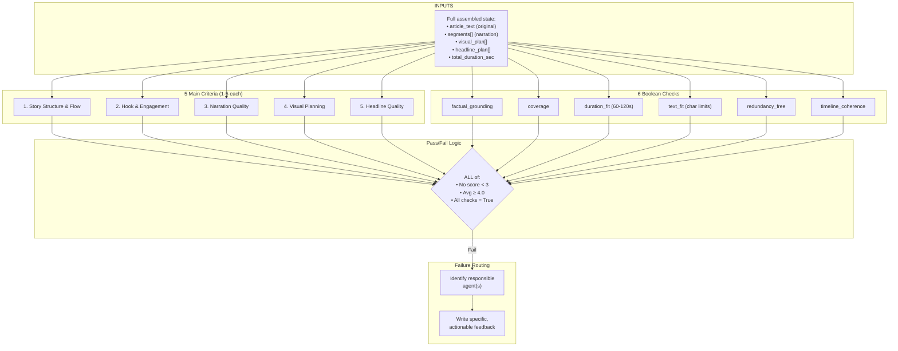

**Scoring Rubric (detailed):**

| Score | Meaning | Story Structure Example |
|---|---|---|
| 1 | Poor | No clear start/end, random facts thrown together |
| 2 | Weak | Has some structure but transitions jarring, ending abrupt |
| 3 | Acceptable | Clear start-middle-end but generic, transitions could be smoother |
| 4 | Good | Smooth progression, strong open/close, broadcast-ready |
| 5 | Excellent | Professional network-quality flow, compelling arc, perfect pacing |

**Failure Responsibility Mapping:**

| Agent | Responsible for these criteria |
|---|---|
| **Editor** | story_structure, hook_engagement, narration_quality, duration_fit, coverage, factual_grounding |
| **Visual** | visual_planning, timeline_coherence |
| **Headline** | headline_quality, text_fit, redundancy_free |

**Feedback Quality — SPECIFIC, not generic:**

```
❌ BAD feedback:  "Improve narration quality."
✅ GOOD feedback: "Segment 2 narration repeats the fire engine count already 
                   mentioned in Segment 1. Remove repetition and add detail 
                   about evacuation. Segment 1 hook is flat — needs urgency.
                   Try: 'Breaking tonight, panic spread across...'"
```

---

## 🔄 LangGraph Workflow

### Complete Workflow Diagram

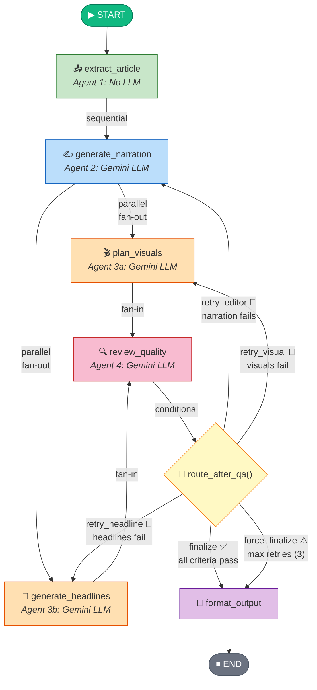

### Workflow Requirements Checklist

| LangGraph Requirement | How It's Satisfied | Code Location |
|---|---|---|
| **Sequential flow** | `START → extract_article → generate_narration` — Editor must wait for extraction | `graph.py` lines: `add_edge(START, "extract_article")`, `add_edge("extract_article", "generate_narration")` |
| **Parallel step** | `generate_narration → [plan_visuals, generate_headlines]` — two edges from same node | `graph.py` lines: `add_edge("generate_narration", "plan_visuals")`, `add_edge("generate_narration", "generate_headlines")` |
| **Fan-in sync** | Both visuals + headlines must complete before QA runs | `graph.py` lines: `add_edge("plan_visuals", "review_quality")`, `add_edge("generate_headlines", "review_quality")` |
| **Conditional edges** | `route_after_qa()` returns one of 5 routing strings | `graph.py`: `add_conditional_edges("review_quality", route_after_qa, {...})` |
| **Evaluation + retry** | QA scores, determines pass/fail, identifies failing agent | `agents/qa.py`: `_evaluate_pass()`, `_determine_failure_targets()` |
| **Skip unnecessary paths** | If QA passes → finalize immediately, no retries | Router returns `"finalize"` when `state["qa_pass"] == True` |
| **Retry only weak agent** | Single-target priority: editor > visual > headline | Router checks targets list in priority order |

### How Parallel Execution Works in LangGraph

When a node has **two outgoing edges**, LangGraph executes both targets in the **same superstep** (truly parallel):

```python
# These two lines create parallel execution:
workflow.add_edge("generate_narration", "plan_visuals")      # → runs in parallel
workflow.add_edge("generate_narration", "generate_headlines") # → runs in parallel

# Both must complete before QA (fan-in):
workflow.add_edge("plan_visuals", "review_quality")
workflow.add_edge("generate_headlines", "review_quality")
```

The `errors` state field uses `Annotated[list[str], operator.add]` — LangGraph's reducer pattern that safely **merges** lists from parallel branches instead of one overwriting the other.

---

## 🔀 Conditional Edge Routing

### Router Decision Tree

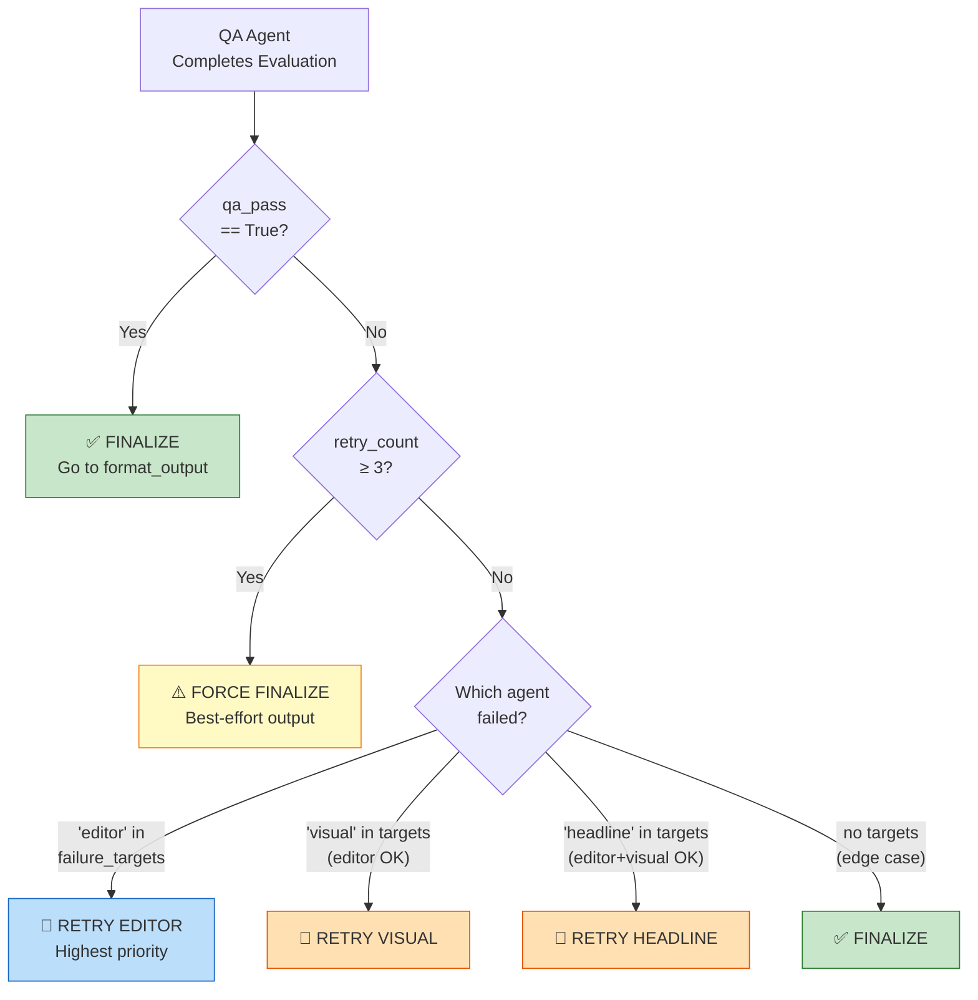

### Why Single-Target Priority Retry?

```
Priority: editor > visual > headline

Reason:
├── Editor output (narration) is the INPUT for both Visual and Headline agents
├── If narration changes → visuals and headlines may need to change too
├── So: fix Editor FIRST → then Visual/Headline regenerate with corrected narration
├── On the NEXT QA pass, if Editor now passes but Visual still fails → retry only Visual
└── This cascading approach produces better results than retrying all at once
```

### Example Retry Scenario

```
Attempt 1:
  Editor: ✅ (score 4)    Visuals: ❌ (score 2)    Headlines: ❌ (score 2)
  → Router: retry visual (editor passes, visual is next priority)
  
Attempt 2 (visual retried):
  Editor: ✅ (score 4)    Visuals: ✅ (score 4)    Headlines: ❌ (score 2)
  → Router: retry headline (editor+visual pass now)
  
Attempt 3 (headline retried):
  Editor: ✅ (score 4)    Visuals: ✅ (score 4)    Headlines: ✅ (score 4)
  → Router: finalize ✅ (all pass!)
```

---

## 🔁 Evaluation & Retry Mechanism

### Scoring System

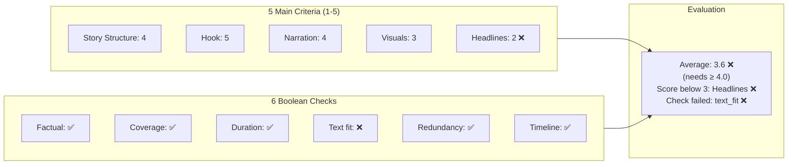

### Pass/Fail Rules

```python
def evaluate_pass(scores, checks):
    # Rule 1: NO criterion below 3
    if any(score < 3 for score in scores.values()):
        return False  # ❌ Immediate fail
    
    # Rule 2: Average must be ≥ 4.0
    if average(scores) < 4.0:
        return False  # ❌ Below quality bar
    
    # Rule 3: ALL boolean checks must pass
    if not all(checks.values()):
        return False  # ❌ Failed quality gate
    
    return True  # ✅ Broadcast-ready!
```

### Retry Flow Example

```
Run 1 (initial):
  ┌─────────────────────────────────────────────────┐
  │ Scores: Structure=4, Hook=2, Narration=4,       │
  │         Visual=3, Headline=2                     │
  │ Result: ❌ FAIL (Hook=2 < 3, Headline=2 < 3)    │
  │ Targets: ["editor", "headline"]                  │
  │ Route: retry_editor (highest priority)           │
  │                                                   │
  │ Editor Feedback: "Segment 1 hook is flat.        │
  │ Try: 'Breaking tonight, panic spread across...'  │
  │ Segment 3 repeats info from Segment 1."          │
  └─────────────────────────────────────────────────┘
                        │
                        ▼
Run 2 (editor retried):
  ┌─────────────────────────────────────────────────┐
  │ Scores: Structure=4, Hook=4, Narration=4,       │
  │         Visual=4, Headline=2                     │
  │ Result: ❌ FAIL (Headline=2 < 3)                 │
  │ Targets: ["headline"]                            │
  │ Route: retry_headline                            │
  │                                                   │
  │ Headline Feedback: "Segments 2 and 3 share       │
  │ same headline. Segment 4 subheadline is 72       │
  │ chars (max 60)."                                  │
  └─────────────────────────────────────────────────┘
                        │
                        ▼
Run 3 (headline retried):
  ┌─────────────────────────────────────────────────┐
  │ Scores: Structure=4, Hook=4, Narration=5,       │
  │         Visual=4, Headline=4                     │
  │ Result: ✅ PASS (avg=4.2, all ≥3, checks pass)  │
  │ Route: finalize                                   │
  └─────────────────────────────────────────────────┘
```

---

## 📦 State Schema

The entire pipeline shares a single `BroadcastState` TypedDict. Every agent reads from and writes to this shared state:

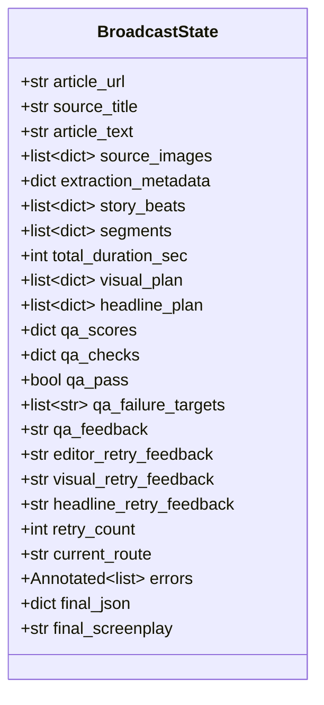

**Key design choice:** The `errors` field uses `Annotated[list[str], operator.add]` so that the Visual and Headline agents (running in parallel) can both safely append errors without overwriting each other.

---

## 📄 Output Format

### Structured JSON

```json
{
  "article_url": "https://example.com/news/city-market-fire",
  "source_title": "Massive Fire Breaks Out in City Market",
  "video_duration_sec": 75,
  "segments": [
    {
      "segment_id": 1,
      "start_time": "00:00",
      "end_time": "00:10",
      "layout": "anchor_left + source_visual_right",
      "anchor_narration": "Good evening. We begin with breaking news from central Delhi, where a major fire has broken out in a crowded market area.",
      "main_headline": "Major Fire Hits Delhi Market",
      "subheadline": "Emergency crews rush to crowded commercial zone",
      "top_tag": "BREAKING",
      "left_panel": "AI anchor in studio",
      "right_panel": "Source article image 1 showing smoke and flames",
      "source_image_url": "https://example.com/image1.jpg",
      "ai_support_visual_prompt": null,
      "transition": "cut"
    },
    {
      "segment_id": 2,
      "start_time": "00:10",
      "end_time": "00:22",
      "layout": "anchor_left + ai_support_visual_right",
      "anchor_narration": "Officials say multiple fire engines were sent to the scene after thick smoke was seen rising above nearby shops and buildings.",
      "main_headline": "Multiple Fire Engines Deployed",
      "subheadline": "Smoke seen rising above nearby shops",
      "top_tag": "LIVE",
      "left_panel": "AI anchor in studio",
      "right_panel": "AI-generated support visual of firefighters battling flames",
      "source_image_url": null,
      "ai_support_visual_prompt": "realistic news-style market fire at night, firefighters, smoke, emergency response, urban India",
      "transition": "crossfade"
    }
  ]
}
```

### Human-Readable Screenplay

```
═══════════════════════════════════════════════════════════
📺 BROADCAST SCREENPLAY
═══════════════════════════════════════════════════════════
Source: "Massive Fire Breaks Out in City Market"
URL:    https://example.com/news/city-market-fire
Duration: 75 seconds | Segments: 5
═══════════════════════════════════════════════════════════

━━━ SEGMENT 1 ━━━ [00:00 – 00:10] ━━━━━━━━━━━━━━━━━━━━━━
🏷️  BREAKING
📰 Major Fire Hits Delhi Market
   Emergency crews rush to crowded commercial zone

🎬 Layout: anchor_left + source_visual_right
👤 Left:  AI anchor in studio
🖼️  Right: Source article image 1 showing smoke
📸 Image: https://example.com/image1.jpg

🎙️ NARRATION:
"Good evening. We begin with breaking news from central
Delhi, where a major fire has broken out in a crowded
market area."

⏭️  Transition: cut

━━━ SEGMENT 2 ━━━ [00:10 – 00:22] ━━━━━━━━━━━━━━━━━━━━━━
🏷️  LIVE
📰 Multiple Fire Engines Deployed
   Smoke seen rising above nearby shops

🎬 Layout: anchor_left + ai_support_visual_right
👤 Left:  AI anchor in studio
🖼️  Right: AI-generated visual
🎨 Prompt: "realistic news-style market fire, firefighters,
   smoke, emergency response, urban India"

🎙️ NARRATION:
"Officials say multiple fire engines were sent to the
scene after thick smoke was seen rising above nearby
shops and buildings."

⏭️  Transition: crossfade

═══════════════════════════════════════════════════════════
📊 QA SCORES
═══════════════════════════════════════════════════════════
Story Structure:  ★★★★☆ (4/5)
Hook & Engagement: ★★★★★ (5/5)
Narration Quality: ★★★★☆ (4/5)
Visual Planning:   ★★★★★ (5/5)
Headline Quality:  ★★★★☆ (4/5)
Overall Average:   4.4/5 ✅ PASS
Retries Used: 1/3
═══════════════════════════════════════════════════════════
```

---

## 📡 LangFuse Observability

**LangFuse is mandatory** — every pipeline run is fully traced.

### What Gets Traced

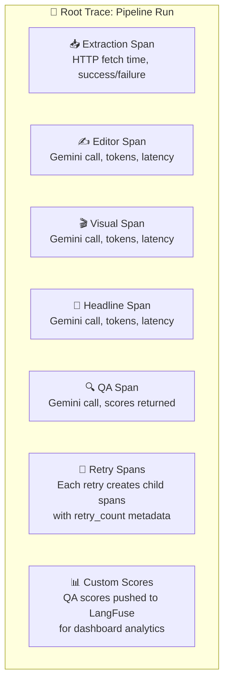

### Integration Code

```python
from langfuse.langchain import CallbackHandler

langfuse_handler = CallbackHandler(
    public_key=os.getenv("LANGFUSE_PUBLIC_KEY"),
    secret_key=os.getenv("LANGFUSE_SECRET_KEY"),
    host=os.getenv("LANGFUSE_BASE_URL", "https://cloud.langfuse.com"),
)

# Every graph invocation includes the handler:
result = app.invoke(
    {"article_url": url, "retry_count": 0, "errors": []},
    config={"callbacks": [langfuse_handler]}
)
```

---

## 🛠 Tech Stack

| Component | Technology | Purpose |
|---|---|---|
| **LLM** | Google Gemini 2.0 Flash (`langchain-google-genai`) | Narration, visuals, headlines, QA scoring |
| **Orchestration** | LangGraph (`langgraph`) | Multi-agent workflow, conditional edges, parallel steps |
| **Observability** | LangFuse (`langfuse`) | Tracing, latency monitoring, QA score dashboards |
| **Extraction** | Trafilatura + BeautifulSoup4 | Article text and image extraction |
| **Models** | Pydantic v2 | Structured LLM output + validation |
| **Frontend** | Streamlit | Web UI with progress tracking |
| **HTTP** | Requests + HTTPX | URL fetching with fallback |
| **Environment** | python-dotenv | Secret management |

---

## 📂 Project Structure

```
loqo ai/
│
├── app.py                              # 🖥️ Streamlit web interface
├── main.py                             # 🖥️ CLI entry point
├── requirements.txt                    # 📦 Python dependencies
├── .env.example                        # 🔑 Environment variable template
├── README.md                           # 📖 This file
│
├── src/
│   ├── __init__.py
│   ├── config.py                       # ⚙️ Gemini LLM + LangFuse setup
│   ├── state.py                        # 📋 BroadcastState TypedDict (shared state)
│   ├── graph.py                        # 🔗 LangGraph assembly + conditional edges
│   │
│   ├── agents/                         # 🤖 Agent implementations
│   │   ├── __init__.py
│   │   ├── extraction.py              # Agent 1: Article Extraction (no LLM)
│   │   ├── editor.py                  # Agent 2: News Editor (Gemini)
│   │   ├── visual.py                  # Agent 3a: Visual Packaging (Gemini)
│   │   ├── headline.py               # Agent 3b: Headline Generator (Gemini)
│   │   └── qa.py                      # Agent 4: QA Evaluation (Gemini)
│   │
│   ├── tools/                          # 🔧 Extraction tools (no LLM)
│   │   ├── __init__.py
│   │   ├── scraper.py                 # URL fetch + trafilatura extraction
│   │   └── image_extractor.py         # HTML image extraction + filtering
│   │
│   ├── prompts/                        # 💬 System & user prompts
│   │   ├── __init__.py
│   │   ├── editor_prompts.py          # Editor persona + narration rules
│   │   ├── visual_prompts.py          # Visual director + layout rules
│   │   ├── headline_prompts.py        # Graphics producer + char limits
│   │   └── qa_prompts.py             # QA reviewer + scoring rubric
│   │
│   ├── models/                         # 📐 Pydantic schemas
│   │   ├── __init__.py
│   │   └── schemas.py                 # EditorOutput, VisualOutput, HeadlineOutput, QAResult
│   │
│   └── output/                         # 📤 Output formatting
│       ├── __init__.py
│       ├── formatter.py               # Merges agent outputs → JSON + screenplay
│       └── templates.py               # Text templates for screenplay formatting
```

---

## 🚀 Quick Start

### Prerequisites

- Python 3.10+
- Google Gemini API key ([Get one here](https://aistudio.google.com/apikey))
- LangFuse account ([Sign up here](https://cloud.langfuse.com))

### 1. Install Dependencies

```bash
cd "loqo ai"
pip install -r requirements.txt
```

### 2. Configure Environment

```bash
cp .env.example .env
```

Edit `.env` with your keys:

```env
GOOGLE_API_KEY=your-gemini-api-key-here
LANGFUSE_PUBLIC_KEY=pk-lf-your-public-key
LANGFUSE_SECRET_KEY=sk-lf-your-secret-key
LANGFUSE_BASE_URL=https://cloud.langfuse.com
```

### 3. Run via CLI

```bash
python main.py https://www.ndtv.com/india-news/major-fire-breaks-out-in-delhi-market

# Or without URL (will prompt):
python main.py
```

**Outputs:**
- `output.json` — Structured JSON screenplay
- `screenplay.txt` — Human-readable screenplay
- Console — Full screenplay + QA scores

### 4. Run via Streamlit Web UI

```bash
streamlit run app.py
```

Then open `http://localhost:8501` in your browser.

---

## 🖥 Streamlit Web UI

The Streamlit interface provides:

| Feature | Description |
|---|---|
| **URL Input** | Paste any public news article URL |
| **Pipeline Progress** | Real-time status of each agent (waiting → running → done) |
| **QA Score Display** | Star ratings for all 5 criteria + pass/fail badge |
| **Retry Tracking** | Shows which retry round is active |
| **Screenplay Tab** | Rich visual display of each segment with tags, headlines, narration |
| **JSON Tab** | Raw structured JSON output |
| **Extraction Info Tab** | Article metadata, source images found, warnings |
| **Download Buttons** | Export JSON and screenplay as files |

### UI Layout

```
┌─────────────────────────────────────────────────────────┐
│  📺 LOQO AI                                             │
│  News URL to Dynamic Broadcast Screenplay Generator      │
├─────────────────────────────────────────────────────────┤
│  [Enter News Article URL_______________________] [▶ GO] │
├─────────────────────────────────────────────────────────┤
│  ⚡ Pipeline Progress                                    │
│  ✅ Article Extraction — Done                            │
│  ✅ Narration Generation — Done                          │
│  ⏳ Visual Packaging — Running                           │
│  ⏳ Headline Generation — Running                        │
│  ⬜ QA Review — Waiting                                  │
│  ⬜ Final Output — Waiting                               │
├─────────────────────────────────────────────────────────┤
│  📊 Quality Scores                                       │
│  Structure: ★★★★☆  Hook: ★★★★★  Narration: ★★★★☆      │
│  Visuals: ★★★★★    Headlines: ★★★★☆                    │
│  Average: 4.4/5 ✅ PASSED | Retries: 1/3                │
├─────────────────────────────────────────────────────────┤
│  [📄 Screenplay] [📊 JSON] [ℹ️ Info]                    │
│  ┌─────────────────────────────────────────────────┐    │
│  │ SEGMENT 1 [00:00-00:10]                         │    │
│  │ 🏷️ BREAKING                                    │    │
│  │ Major Fire Hits Delhi Market                     │    │
│  │ Emergency crews rush to zone                     │    │
│  │ 🎙️ "Good evening. Breaking news tonight..."    │    │
│  └─────────────────────────────────────────────────┘    │
│                                                          │
│  [📥 Download JSON]  [📥 Download Screenplay]            │
└─────────────────────────────────────────────────────────┘
```

---

## 📝 License

This project was built as part of the **LOQO AI internship assignment**.
